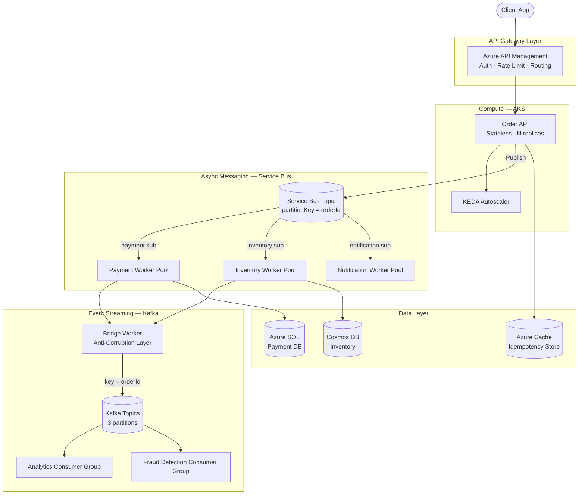

# Azure Cloud-Native Reference Architecture

> **A decision-driven architecture repository** for designing secure, scalable, and cost-optimised cloud-native systems on Microsoft Azure. Built from real-world enterprise delivery experience across financial services, IoT, and digital transformation programmes.

[](LICENSE)


---

## 🗺️ Architecture Overview



---

## 📁 Repository Structure

```
├── docs/
│   ├── architecture/
│   │   ├── 01-system-overview.md
│   │   ├── 02-sequence-diagrams.md
│   │   ├── 03-scaling-partitioning.md
│   │   ├── 04-security-zero-trust.md
│   │   └── 05-observability.md
│   ├── adr/
│   │   ├── ADR-001-service-bus-vs-event-hubs.md
│   │   ├── ADR-002-aks-vs-app-service.md
│   │   ├── ADR-003-keda-autoscaling.md
│   │   ├── ADR-004-cosmos-vs-sql.md
│   │   └── ADR-005-kafka-partitioning-key.md
│   └── patterns/
│       ├── idempotency-pattern.md
│       ├── saga-compensation.md
│       └── circuit-breaker.md
├── bicep/
│   ├── main.bicep
│   ├── modules/
│   │   ├── aks.bicep
│   │   ├── servicebus.bicep
│   │   ├── keyvault.bicep
│   │   └── monitoring.bicep
│   └── parameters/
│       ├── dev.bicepparam
│       └── prod.bicepparam
└── src/
    └── worker-sample/
```

---

## 🧩 Architecture Decision Records

| ADR | Decision | Status |
|---|---|---|
| [ADR-001](docs/adr/ADR-001-service-bus-vs-event-hubs.md) | Use Azure Service Bus for workflow messaging | ✅ Accepted |
| [ADR-002](docs/adr/ADR-002-aks-vs-app-service.md) | AKS for worker pools, App Service for public APIs | ✅ Accepted |
| [ADR-003](docs/adr/ADR-003-keda-autoscaling.md) | KEDA for event-driven autoscaling on queue depth | ✅ Accepted |
| [ADR-004](docs/adr/ADR-004-cosmos-vs-sql.md) | Cosmos DB for inventory, Azure SQL for payments | ✅ Accepted |
| [ADR-005](docs/adr/ADR-005-kafka-partitioning-key.md) | orderId as Kafka partition key | ✅ Accepted |

---

## 🔑 Key Design Principles

**1. Stateless APIs + KEDA Worker Pools**
APIs scale horizontally with no session state. Workers scale on Service Bus queue depth — not CPU/memory, which lags for queue processors.

**2. Service Bus `partitionKey = orderId`**
Preserves message ordering per order. Avoids timestamp/sequential ID anti-pattern which creates hot partitions.

**3. Bridge Worker as Anti-Corruption Layer**
Separates the Service Bus domain from the Kafka streaming domain. Schema validation at the boundary. Independent versioning on each side.

**4. Idempotency at Every Worker**
Workers store processed `messageId` in Azure Cache (Redis). Duplicate deliveries are safe — no double-charges, no duplicate reservations.

**5. Managed Identity — Zero Credentials in Code**
All service connections use Managed Identity. No connection strings, no secrets in env vars. Key Vault via `DefaultAzureCredential`.

---

## 🚀 Deploy Infrastructure

```bash
git clone https://github.com/sovanguha/azure-cloud-native-reference-architecture.git
cd azure-cloud-native-reference-architecture

az login
az account set --subscription "<your-subscription-id>"

az deployment sub create \
  --location eastus \
  --template-file bicep/main.bicep \
  --parameters bicep/parameters/dev.bicepparam
```

---

## 📐 Well-Architected Framework Alignment

| Pillar | Approach |
|---|---|
| **Reliability** | Circuit breakers, dead-letter queues, health probes, retry with backoff |
| **Security** | Managed Identity, Key Vault, RBAC least-privilege, private endpoints |
| **Cost Optimisation** | KEDA scale-to-zero, right-sized SKUs, reserved instances for baseline |
| **Performance** | Queue-depth scaling, Kafka partitioning, Redis idempotency store |
| **Operational Excellence** | ADRs, Bicep IaC, structured logging, distributed tracing via correlationId |

---

*Built by [Sovan Guha](https://github.com/sovanguha) — Azure Solutions Architect Expert (AZ-305)*
