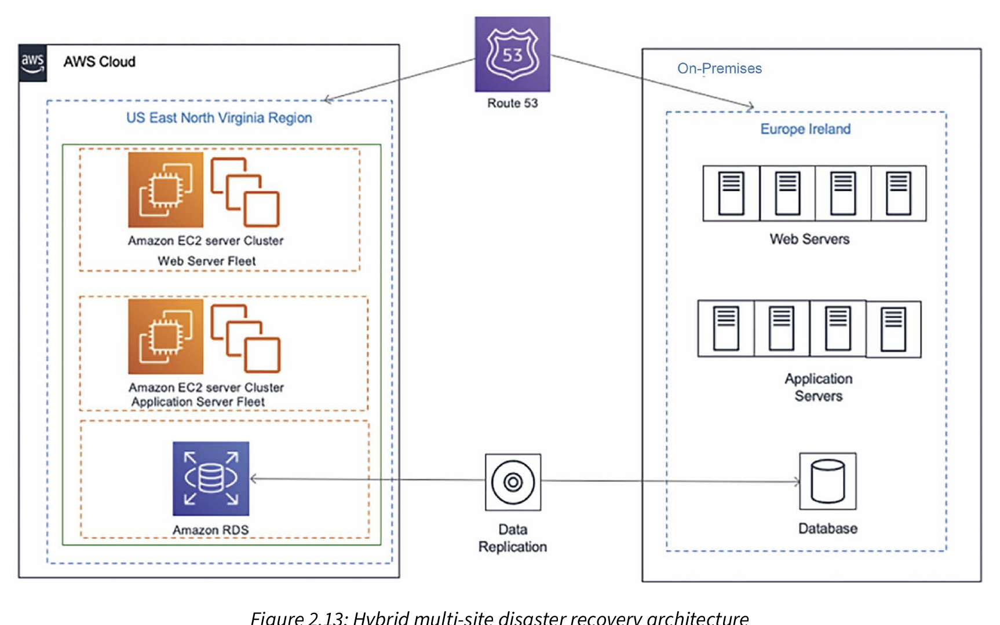

•	RTO measures how much downtime a business can sustain without significant impact; RPO indicates how much data loss a business can 
	tolerate. Reducing RTO and RPO means incurring higher costs, so it is essential to understand whether the business is mission-critical 
	and needs minimal RTO and RPO. For example, a stock trading application cannot afford to lose a single data point, and a railway signaling 
	application cannot be down for a single second, as human life depends on it.

