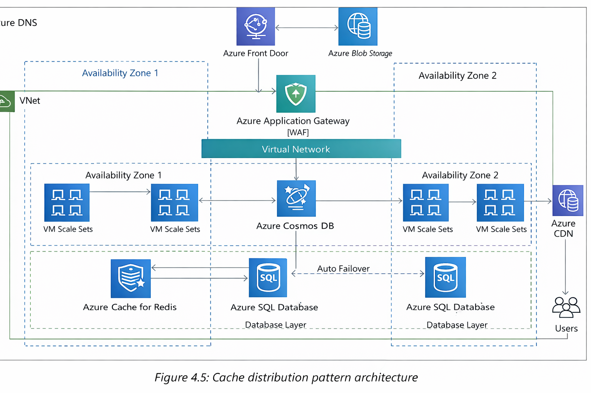

• Client-side caching: Client-side caching is applied to user devices such as mobile and desktop. 
					   Client-side caching caches the previously visited web content to respond faster to a subsequent 
					   request. Each browser has its own caching mechanism. HTTP caching makes the application faster by 
					   caching content in the local browser. The cache-control HTTP header defines browser caching policies
					   for client requests and server responses. These policies define where the content should be cached
					   and how long it will persist, known as the time to live (TTL). Cookies are another method used to store 
					   information on the client’s machine to respond to the browser faster.

• Internet DNS cache: When a user types the website address over the Internet, the public Domain Name System (DNS) server looks
					  up the IP address. Caching this DNS resolution information will reduce the website’s load time. 
					  DNS information can be cached to a local server or browser after the first request, and any further requests
					  to that website will be faster.

• Web content caching: Much of the request involves retrieving web content such as images, videos, and HTML pages. Caching these assets
					   near the user’s location can provide a much faster response for a page load. This also eliminates disk read and 
					   server load time. A content distribution network (CDN) provides a network of edge locations where static content, 
					   such as high-resolution images and videos, can be cached. It’s beneficial for reading heavy applications such as games, 
					   blogs, e-commerce product catalog pages, and more. The user session contains lots of information regarding user preference 
					   and their state. It provides a great user experience by storing the user’s session in its own key-value store 
					   for quick user response.

• Application caching: At the application layer, caching can be applied to store the result of a complex repeated request to avoid business
					   logic calculations and database hits. Overall, it improves application performance and reduces the load on the database 
					   and infrastructure.

• Database caching: Application performance highly depends upon the speed and throughput provided by the database. Database caching increases 
				    database throughput significantly and lowers data retrieval latency. A database cache can be applied in front of any 
					relational or non-relational database. Some database providers integrate caching, while applications handle local caching.

