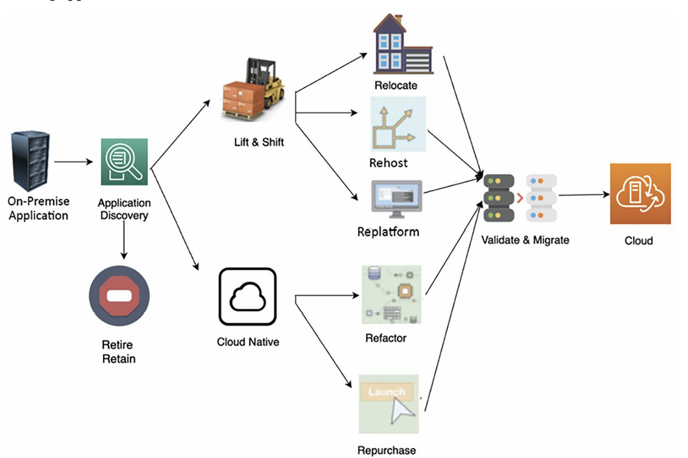

## Lift and shift migration:
Lift and shift is the fastest migration mode; it takes minimal work to move your application. 

Rehost: 
Rehosting is fast, predictable, repeatable, and economical, which makes it the preferred method for migrating to the cloud. 
Rehosting is one of the quickest cloud migration strategies, where the server or application is lifted and shifted from the source 
on-premises environment to the cloud. 
Customers typically use the rehosting technique for the following:
• A temporary development and testing environment
• When servers are running packaged software, such as SAP and Microsoft SharePoint
• When an application doesn’t have an active roadmap

Replatform:
When an OS, server, or database version gets to its end of life, it can trigger a cloud migration project, for example, upgrading the OS of your 
web server to Microsoft Windows 2022.When using the replatform migration strategy, you may need to reinstall your application on the target 
environment, which triggers application changes. 
The following common reasons warrant the use of the replatform technique:
• Changing the OS from 32-bit to 64-bit
• Changing the database engine
• Updating the latest release of the application
• Upgrading the OS
• Upgrading the database engine
• To get the benefits of managed services that are available from cloud vendors, such as managed storage, databases, application deployment, 
and monitoring tools.

## Refactor:
The refactor method involves rearchitecting and rewriting an application before migrating it to the cloud to make it a cloud-native application. 
In refactoring, you change the application to a more modular design, such as from monolithic to microservices. Refactoring to microservices 
helps organizations create small independent teams that can take complete ownership, thus increasing the speed of innovation.

Common examples of refactoring include the following:
• Changing platforms, such as from AIX to Unix
• Database transition from traditional to cloud databases
• Replacing middleware products
• Rearchitecting the application from monolithic to microservices
• Rebuilding application architecture, such as containerizing or making it serverless
• Recoding application components
• Data warehouse modernization to connect organizations to customers

## Repurchase:
When your IT resources and projects are migrated to the cloud, you may need servers or applications requiring you to purchase a cloud-compatible 
license or release. For example, the current on-premises license for your application might need to be validated when you run the application in 
the cloud.
There are multiple ways to address such scenarios of licensing. You can purchase a new license and continue using your application in the cloud, 
or drop the existing one and replace it with another one in the cloud. This replacement could be a SaaS offering of the same application.

## Retain:
You might encounter a few applications in your on-premises environment that are essential for your business but unsuitable for migration because 
of technical reasons, such as the OS/application not being supported on a cloud platform. In such situations, your application cannot be migrated 
to the cloud but you can continue running it in your on-premises environment.

## Retire:
While migrating to the cloud, you may discover the following:
• Rarely used applications
• Applications consuming an excessive amount of server capacity
• Applications that may not be required due to cloud incompatibility
In such a situation, you can retire the existing workload and take a fresh approach that is more cloud-native.

## Possible risks include:
• Data loss and leakage: During the migration, sensitive data can be exposed to risks if not properly encrypted and managed. 
  Ensuring data integrity and security during the migration process is crucial to prevent data breaches.
• Downtime: Migration can lead to system downtime, affecting business operations. Planning   and executing the migration in phases
  or during off-peak hours can minimize the impact on business continuity.
• Cost overruns: Without the proper planning and understanding of cloud pricing models, or ganizations can face unexpected costs. 
  It’s essential to have a clear roadmap and budget for the migration process.
• Performance issues: Applications may not initially perform as expected in the cloud due to differences in the architecture or 
  unforeseen compatibility issues. Rigorous testing and optimization are necessary post-migration.
• Skill gaps: The lack of expertise in cloud computing within the organization can hinder the migration process and future operations. 
  Investing in training and possibly hiring specialists can mitigate this risk.
• Interoperability and integration challenges: Ensuring that existing systems and applications work seamlessly with cloud services can
  be complex, requiring robust integration and testing strategies.
• Compliance: Adhering to industry regulations and compliance standards can be challenging in the cloud environment, especially if the 
  organization operates in a highly regulated sector.
• Vendor lock-in: Relying too much on a single cloud provider’s technologies and services can lead to difficulties in switching providers 
  in the future, potentially affecting flexibility and cost-efficiency.

## Cloud Migration Steps:

The cloud migration steps are the following:
• Discover: Discovery of cloud migration portfolios and on-premises workloads
• Analyze: Analyze discovered data and workloads
• Plan: Plan the migration to the cloud and define the migration strategy
• Design: Design the application as per the migration strategy
• Migrate: Execute the migration strategy
• Integrate: Integrate with other application and system dependencies
• Validate: Validate functionality after migration
• Operate: Plan to operate in the cloud
• Optimize: Optimize your workload for the cloud