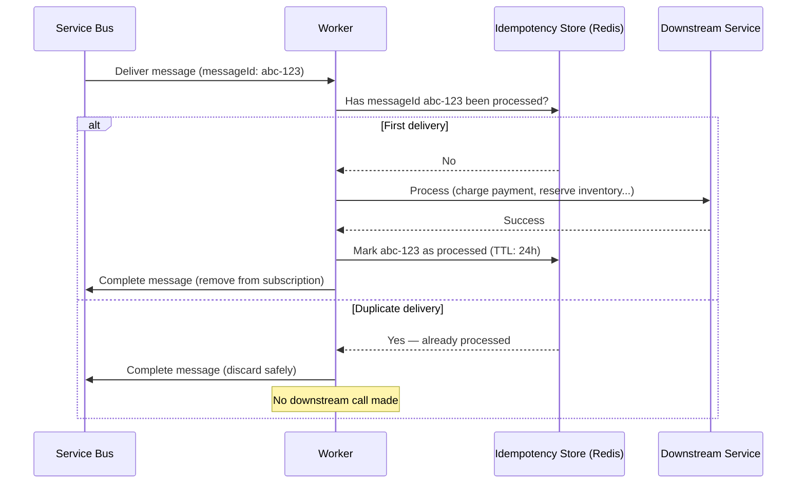

# Idempotency Pattern

## Problem

In distributed systems with at-least-once message delivery (Azure Service Bus, Kafka), the same message may be delivered more than once. For payment processing, inventory reservation, or any state-mutating operation, **duplicate processing causes real harm**:

- Double payment charges
- Overselling inventory
- Duplicate notification sends
- Corrupted audit trails

The Idempotency Pattern ensures that processing the same message multiple times produces the same result as processing it once.

---

## How It Works



---

## Implementation

### Redis-Based Idempotency Store (.NET 8)

```csharp
public sealed class RedisIdempotencyStore : IIdempotencyStore
{
    private readonly IDatabase _redis;
    private const string KeyPrefix = "processed:msg:";

    public RedisIdempotencyStore(IConnectionMultiplexer redis)
    {
        _redis = redis.GetDatabase();
    }

    public async Task<bool> HasBeenProcessedAsync(string messageId)
    {
        return await _redis.KeyExistsAsync($"{KeyPrefix}{messageId}");
    }

    public async Task MarkProcessedAsync(string messageId, TimeSpan expiry)
    {
        // SET key value EX ttl NX (only set if not exists)
        await _redis.StringSetAsync(
            key: $"{KeyPrefix}{messageId}",
            value: DateTime.UtcNow.ToString("O"),
            expiry: expiry,
            when: When.NotExists  // Atomic: only set if absent
        );
    }
}
```

### Worker Integration

```csharp
// In PaymentWorker.HandleMessageAsync:

// 1. Check BEFORE any downstream call
if (await _idempotency.HasBeenProcessedAsync(messageId))
{
    logger.LogWarning("Duplicate message {MessageId} — completing without processing", messageId);
    await args.CompleteMessageAsync(args.Message);
    return;
}

// 2. Process downstream
var result = await _gateway.CapturePaymentAsync(orderId, amount, correlationId);

// 3. Mark AFTER successful processing
// Note: if this step fails, the message is redelivered and processed again.
// The downstream operation must also be idempotent (see Gateway Idempotency below).
await _idempotency.MarkProcessedAsync(messageId, expiry: TimeSpan.FromHours(24));

await args.CompleteMessageAsync(args.Message);
```

---

## Gateway-Level Idempotency

The idempotency store prevents **re-entry into your worker**. But the downstream payment gateway must also support idempotency — if the `MarkProcessedAsync` step fails after the gateway call succeeds, the message will be redelivered and the gateway called again.

**Solution:** Pass `messageId` as an idempotency key to the downstream gateway.

```csharp
// HTTP call to payment gateway
var request = new HttpRequestMessage(HttpMethod.Post, "/v1/charges");
request.Headers.Add("Idempotency-Key", messageId);  // Stripe, Adyen, etc. support this
request.Content = JsonContent.Create(new
{
    amount = placeOrder.Amount,
    orderId = placeOrder.OrderId,
    correlationId = correlationId
});
```

Most payment gateways (Stripe, Adyen, Braintree) natively support `Idempotency-Key` headers. The gateway returns the same response for duplicate calls with the same key.

---

## TTL Strategy

The idempotency store TTL must be longer than the maximum message re-delivery window.

| Worker | Max Delivery Count | Max Lock Duration | Recommended Store TTL |
|---|---|---|---|
| Payment Worker | 5 retries | 5 min × 5 = 25 min | 24 hours |
| Inventory Worker | 5 retries | 2 min × 5 = 10 min | 24 hours |
| Notification Worker | 3 retries | 1 min × 3 = 3 min | 6 hours |
| Bridge Worker | 10 retries | 3 min × 10 = 30 min | 48 hours |

**Why 24h+?** If a message is dead-lettered and manually replayed by an operator, we still want idempotency protection. 24h covers same-day replays.

---

## Cosmos DB Alternative

For scenarios where Redis is not available or persistence across restarts is required:

```csharp
public async Task<bool> HasBeenProcessedAsync(string messageId)
{
    try
    {
        await _container.ReadItemAsync<IdempotencyRecord>(
            id: messageId,
            partitionKey: new PartitionKey(messageId));
        return true; // Found — already processed
    }
    catch (CosmosException ex) when (ex.StatusCode == HttpStatusCode.NotFound)
    {
        return false;
    }
}

public async Task MarkProcessedAsync(string messageId, TimeSpan expiry)
{
    var record = new IdempotencyRecord(
        Id: messageId,
        ProcessedAt: DateTime.UtcNow,
        Ttl: (int)expiry.TotalSeconds  // Cosmos DB TTL
    );
    await _container.UpsertItemAsync(record, new PartitionKey(messageId));
}
```

---

## Monitoring

```
Metric: idempotency_duplicate_count (increment in HasBeenProcessedAsync when true)
Alert: duplicate rate > 5% of total messages → investigate upstream re-publishing
```

High duplicate rates indicate a problem in the publisher or message broker, not normal at-least-once behaviour.
